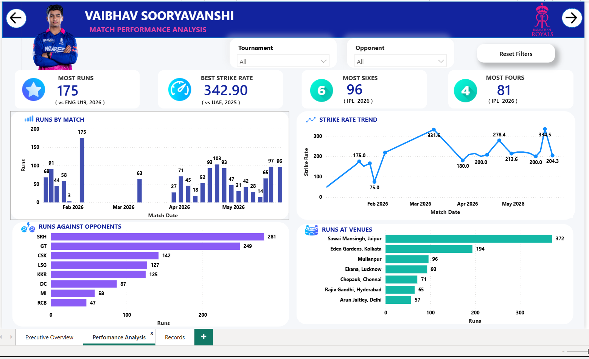
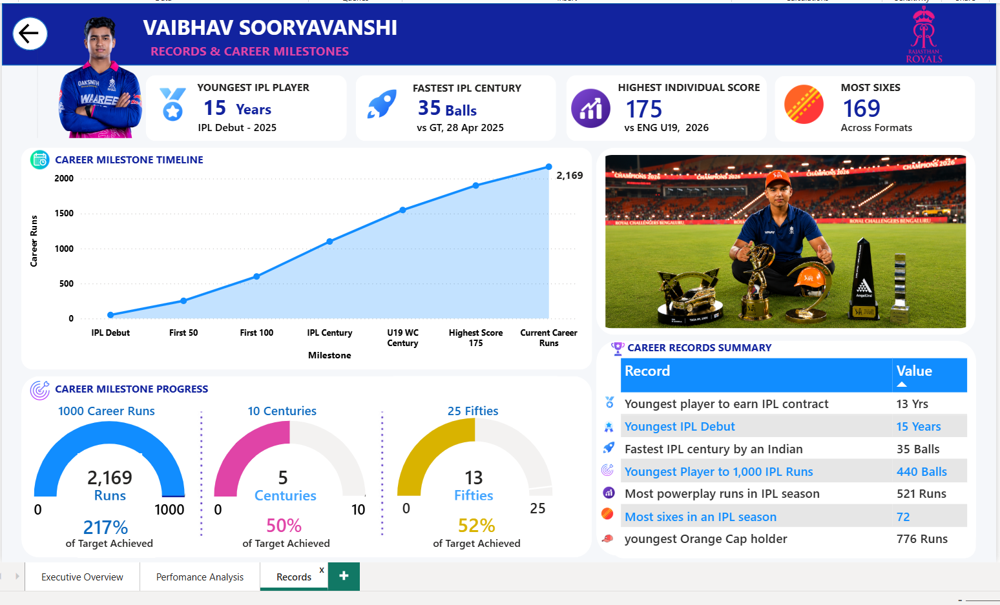

# 🏏 Vaibhav Suryavanshi Career Analytics Dashboard

## Overview

This project is a 3-page interactive Power BI dashboard designed to analyze the career performance, achievements, and milestones of Vaibhav Suryavanshi.

The dashboard focuses on transforming cricket data into actionable insights through KPI tracking, performance analysis, milestone visualization, and interactive storytelling.

---

## Dashboard Pages

### 1. Executive Overview
- Career KPIs
- Player Profile
- Runs Distribution by Tournament
- Career Highlights

### 2. Match Performance Analysis
- Runs by Match
- Strike Rate Trend
- Runs Against Opponents
- Venue Performance Analysis
- Interactive Filters

### 3. Records & Career Milestones
- Career Milestone Timeline
- Career Progress Tracking
- Records Summary
- Achievement Highlights

---

## Tools Used

- Power BI
- Power Query
- DAX
- Data Modeling
- Data Visualization

---

## Key Features

✔ Interactive Navigation

✔ KPI Cards & Performance Metrics

✔ Dynamic Filtering

✔ Career Milestone Tracking

✔ Sports Analytics Storytelling

---

## Screenshots

### Executive Overview

### Performance Analysis

### Records & Milestones

---

## Disclaimer

This dashboard was developed for educational, portfolio, and analytical storytelling purposes.

While efforts were made to use accurate information, users should validate statistics from official cricket sources before using them for reporting or decision-making.

Data analysis should always involve proper validation and verification rather than blind acceptance of available datasets.

---

## Author

T. Vijaya Manikanta

Aspiring Data Analyst | Power BI | SQL | Excel | Data Visualization
